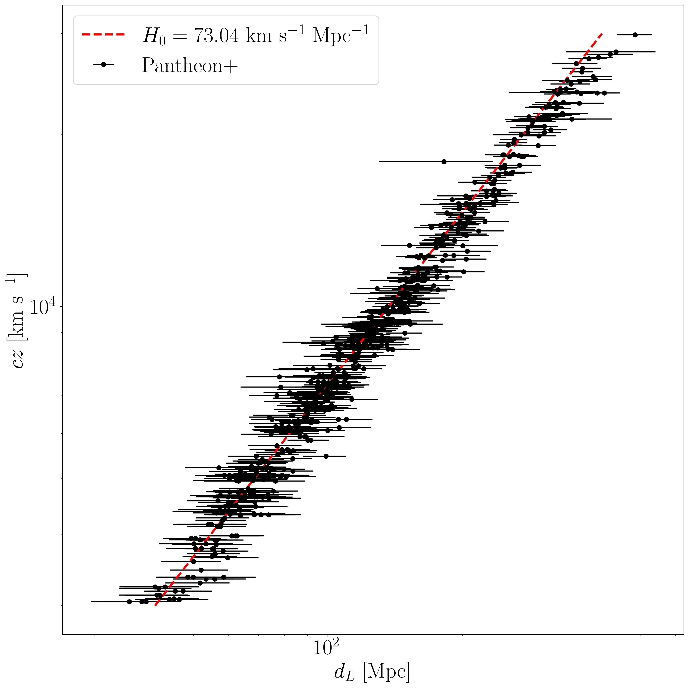

# Reproducing-the-Hubble-Tension
The Hubble Tension is one of the most pressing issues in modern cosmology. Independent measurements of the expansion rate of the universe using early and late universe phenomena disagree by around 5σ. Astronomers who extrapolate the expansion rate from the Cosmic Microwave Background (CMB) find a significantly lower value than the classical measurements of late universe objects like type 1a supernova. This tension indicates that the modern cosmological model is in some way incomplete. In this paper I recreate the Hubble Tension by measuring both early and late universe expansion rates using Planck Collaboration et al. (2020b) data of CMB anisotropies and Scolnic et al. (2022) data of type 1a supernovae. Read the full paper [here](paper/Reproducing%the%Hubble%Tension.pdf).

